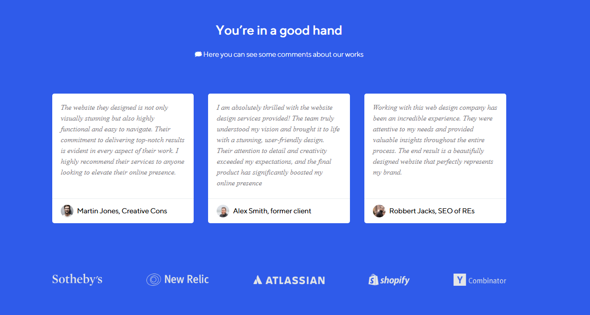

# Basic CSS Flexbox Project

## Overview

This is a simple, single-page project that demonstrates the use of Flexbox in CSS for layout design. It’s ideal for anyone looking to understand Flexbox principles in a straightforward setup.

## Features

- Utilizes only Flexbox for layout
- Single-page, responsive design

## Installation

1. Clone or download the repository.
2. Open the `index.html` file.

## Usage
Simply open the `index.html` file in any browser. No installations or dependencies are needed.

## Contributing
Contributions are welcome! Feel free to expand on this project by adding more sections.

  

 

  

